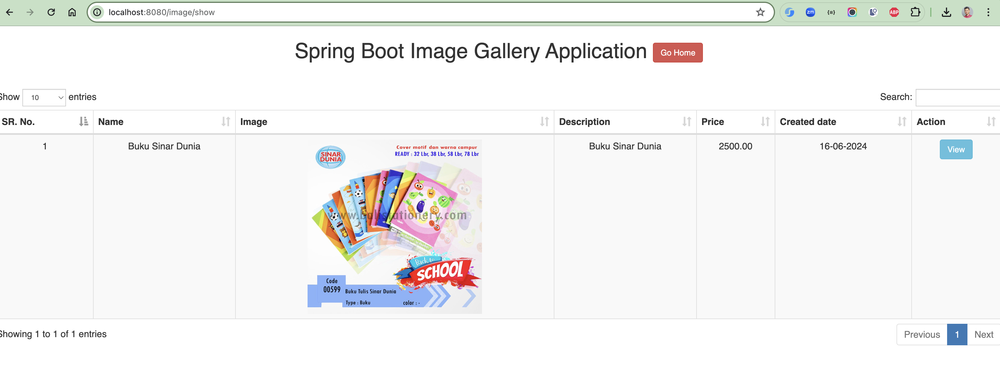
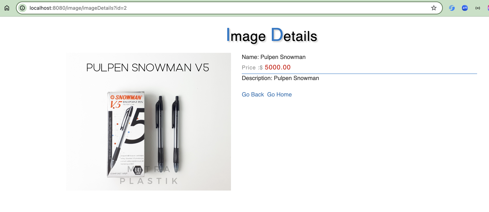

# Spring Boot Image Gallery App

A full-featured web application for managing and displaying image galleries built with Spring Boot 3.5.6 and MySQL. This
application allows users to upload, store, and view images with associated metadata such as name, description, and
price.

## Features

- **Image Upload**: Upload images with metadata (name, description, price)
- **Image Storage**: Store images in MySQL database as BLOB
- **Image Gallery**: Display all uploaded images in a responsive gallery view
- **Image Details**: View detailed information for individual images
- **File Validation**: Secure file upload with validation and path traversal protection
- **Multipart File Support**: Handle large file uploads up to 200MB
- **RESTful API**: Well-structured REST endpoints for image operations
- **Thymeleaf Templates**: Server-side rendered views for better SEO
- **Auto Database Creation**: Automatic database schema generation
- **ELK Stack Integration**: Optional logging with Filebeat, Logstash, and Elasticsearch

## Technology Stack

### Backend

- **Java 21**
- **Spring Boot 3.5.6**
- **Spring Data JPA** - Database operations
- **Spring Web** - REST API
- **Thymeleaf** - Template engine
- **Lombok** - Reduce boilerplate code
- **Spring DevTools** - Hot reload during development

### Database

- **MySQL** - Primary database
- **MySQL Connector/J** - JDBC driver

### Build Tool

- **Maven** - Dependency management and build

### Optional

- **ELK Stack** - Logging and monitoring
    - Filebeat - Log shipping
    - Logstash - Log processing
    - Elasticsearch - Log storage and search

## Prerequisites

Before running this application, ensure you have the following installed:

- **Java Development Kit (JDK) 21** or higher
- **Maven 3.6+**
- **MySQL 8.0+**
- **Git** (for cloning the repository)

## Installation

### 1. Clone the Repository

```bash
git clone https://github.com/hendisantika/spring-boot-image-gallery-app.git
cd spring-boot-image-gallery-app
```

### 2. Configure MySQL Database

Make sure your MySQL server is running. The application will automatically create the database `image_gallery` if it
doesn't exist.

### 3. Update Database Configuration

Edit `src/main/resources/application.properties` and update the following properties according to your MySQL setup:

```properties
spring.datasource.url=jdbc:mysql://localhost:3306/image_gallery?createDatabaseIfNotExist=true&useUnicode=true&useJDBCCompliantTimezoneShift=true&useLegacyDatetimeCode=false&serverTimezone=Asia/Jakarta&useSSL=false&allowPublicKeyRetrieval=true
spring.datasource.username=YOUR_MYSQL_USERNAME
spring.datasource.password=YOUR_MYSQL_PASSWORD
```

### 4. Build and Run the Application

Using Maven:

```bash
mvn clean install
mvn spring-boot:run
```

Or using the Maven wrapper:

```bash
./mvnw clean install
./mvnw spring-boot:run
```

### 5. Access the Application

Open your web browser and navigate to:

```
http://localhost:8080
```

## Configuration

### Application Properties

Key configurations in `application.properties`:

```properties
# Database Configuration
spring.datasource.url=jdbc:mysql://localhost:3306/image_gallery?createDatabaseIfNotExist=true
spring.datasource.username=root
spring.datasource.password=root
spring.jpa.hibernate.ddl-auto=update
# File Upload Configuration
uploadDir=./resources
spring.servlet.multipart.enabled=true
spring.servlet.multipart.file-size-threshold=2KB
spring.servlet.multipart.max-file-size=200MB
spring.servlet.multipart.max-request-size=215MB
```

### File Upload Limits

- **Maximum File Size**: 200MB
- **Maximum Request Size**: 215MB
- **File Size Threshold**: 2KB

## Usage

### Upload an Image

1. Navigate to the home page (`http://localhost:8080`)
2. Fill in the image details:
    - Name
    - Description
    - Price
3. Select an image file
4. Click submit to upload

### View All Images

Navigate to `http://localhost:8080/image/show` to view all uploaded images in the gallery.

### View Image Details

Click on any image to view its detailed information including name, description, and price.

## API Endpoints

| Method | Endpoint                      | Description                               |
|--------|-------------------------------|-------------------------------------------|
| `GET`  | `/` or `/home`                | Home page                                 |
| `POST` | `/image/saveImageDetails`     | Upload new image with details             |
| `GET`  | `/image/display/{id}`         | Display image by ID (returns image bytes) |
| `GET`  | `/image/imageDetails?id={id}` | View image details page                   |
| `GET`  | `/image/show`                 | Show all images in gallery                |

### Example: Upload Image

```bash
curl -X POST http://localhost:8080/image/saveImageDetails \
  -F "name=Sample Image" \
  -F "description=A beautiful sample image" \
  -F "price=99.99" \
  -F "image=@/path/to/your/image.jpg"
```

## Screenshots

### Home Page


### Image Details


## Project Structure

```
spring-boot-image-gallery-app/
├── src/
│   ├── main/
│   │   ├── java/
│   │   │   └── id/my/hendisantika/imagegalleryapp/
│   │   │       ├── controller/
│   │   │       │   ├── ImageGalleryController.java
│   │   │       │   └── LogController.java
│   │   │       ├── entity/
│   │   │       │   └── ImageGallery.java
│   │   │       ├── repository/
│   │   │       │   └── ImageGalleryRepository.java
│   │   │       ├── service/
│   │   │       │   └── ImageGalleryService.java
│   │   │       └── SpringBootImageGalleryAppApplication.java
│   │   └── resources/
│   │       ├── application.properties
│   │       ├── static/
│   │       └── templates/
│   └── test/
├── pom.xml
└── README.md
```

## Database Schema

The application uses a single table `image_gallery` with the following structure:

| Column        | Type          | Description                  |
|---------------|---------------|------------------------------|
| `id`          | BIGINT        | Primary key (auto-increment) |
| `name`        | VARCHAR       | Image name                   |
| `description` | VARCHAR       | Image description            |
| `price`       | DECIMAL(10,2) | Image price                  |
| `image`       | LONGBLOB      | Image binary data            |
| `create_date` | TIMESTAMP     | Creation timestamp           |

## ELK Stack Integration (Optional)

This application supports logging integration with the ELK stack for advanced log management and analysis.

### Prerequisites

- Filebeat
- Logstash
- Elasticsearch

### Configuration

#### Logstash Configuration

Create `logstash-sample.conf`:

```conf
# Read input from filebeat by listening to port 5044
input {
  beats {
    port => "5044"
  }
}

output {
  stdout {
    codec => rubydebug
  }

  # Sending properly parsed log events to elasticsearch
  elasticsearch {
    hosts => ["https://localhost:9200/"]
    index => "logfromfilebeat-%{+YYYY.MM.dd}"
    user => "elastic"
    password => "YOUR_ELASTICSEARCH_PASSWORD"
    ssl => true
    ssl_certificate_verification => false
  }
}
```

#### Filebeat Configuration

Create or update `filebeat.yml`:

```yaml
filebeat.inputs:
  - type: filestream
    id: my-filestream-id
    paths:
      - /path/to/logs/*.log

output:
  logstash:
    hosts: [ "localhost:5044" ]
```

### Running ELK Stack

1. **Start Filebeat**:
   ```bash
   filebeat -e -c filebeat.yml
   ```

   On Windows:
   ```cmd
   filebeat.exe -e -c filebeat.yml
   ```

2. **Start Logstash**:
   ```bash
   logstash -f ./config/logstash-sample.conf --config.reload.automatic
   ```

   On Windows:
   ```cmd
   logstash.bat -f ./config/logstash-sample.conf --config.reload.automatic
   ```

## Development

### Running in Development Mode

The application includes Spring DevTools for hot reloading during development:

```bash
mvn spring-boot:run
```

### Building for Production

```bash
mvn clean package
java -jar target/image-gallery-app-0.0.1-SNAPSHOT.jar
```

## Troubleshooting

### Common Issues

1. **Database Connection Error**
    - Ensure MySQL is running
    - Verify database credentials in `application.properties`
    - Check if port 3306 is available

2. **File Upload Error**
    - Check file size (must be < 200MB)
    - Ensure upload directory has write permissions
    - Verify multipart configuration

3. **Port Already in Use**
    - Change the server port in `application.properties`:
      ```properties
      server.port=8081
      ```

## Contributing

Contributions are welcome! Please feel free to submit a Pull Request.

1. Fork the repository
2. Create your feature branch (`git checkout -b feature/AmazingFeature`)
3. Commit your changes (`git commit -m 'Add some AmazingFeature'`)
4. Push to the branch (`git push origin feature/AmazingFeature`)
5. Open a Pull Request

## License

This project is open source and available under the [MIT License](LICENSE).

## Author

**Hendi Santika**

- Email: hendisantika@gmail.com
- Telegram: [@hendisantika34](https://t.me/hendisantika34)
- GitHub: [@hendisantika](https://github.com/hendisantika)

## Acknowledgments

- Spring Boot Team for the excellent framework
- MySQL for the reliable database
- All contributors who help improve this project

---

⭐ If you find this project useful, please consider giving it a star!
